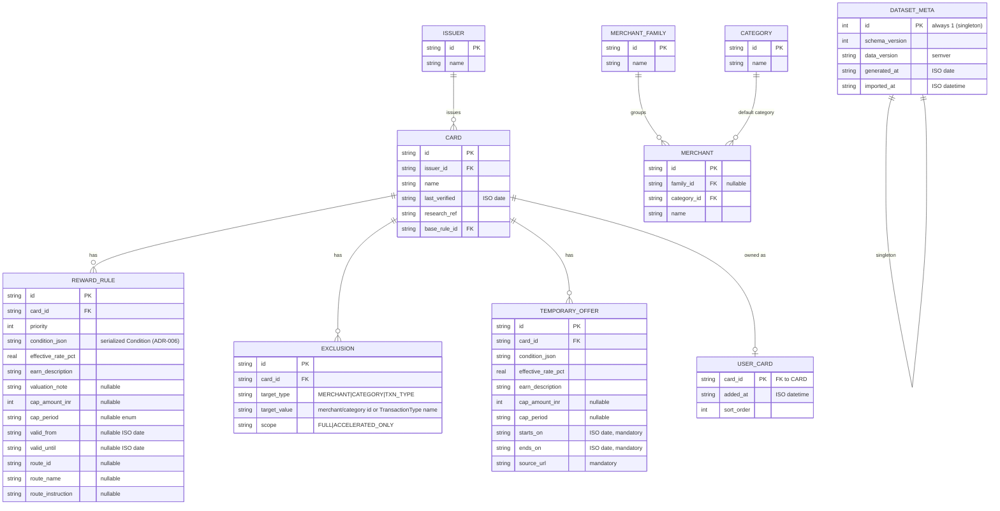

# Data Model — v1.0

*Phase 1 design artifact. Companion to the Rule Engine Specification and roadmap (SSOT). Last updated: 2026-07-10.*

**Scope:** Room persistence model. The **domain model lives in the Rule Engine Spec §4** and is the source of truth for engine behavior; this document defines how it's stored and mapped. Two data zones with different lifecycles:

- **Catalog zone** — read-only at runtime; replaced wholesale by the import pipeline on every data update. Never mutated by user actions.
- **User zone** — mutable; owned by the user (their cards). Survives catalog re-imports.

---

## 1. ER Diagram

---

## 2. Table Notes

### Catalog zone (`issuers`, `categories`, `merchant_families`, `merchants`, `cards`, `reward_rules`, `exclusions`, `temporary_offers`, `dataset_meta`)
- Populated **only** by the importer, inside one transaction: delete-all catalog rows → insert new dataset → update `dataset_meta`. Atomic replace; no row-level diffing in v1 (dataset is small — tens of cards, hundreds of rules).
- `reward_rules.condition_json`: serialized `Condition` via kotlinx.serialization — see ADR-006. All entity references *inside* the JSON are validated by the pipeline validator **before** import (Room FKs can't see into JSON; the validator is the integrity gate for those).
- `card.base_rule_id` points at a row in `reward_rules` whose condition is `Always` — enforced by the validator, not the DB.
- `exclusions.target_type/target_value` is a flat discriminator pair (no JSON needed — exclusion targets are always a single reference, unlike composable conditions).
- `temporary_offers`: **schema only in v1**; the importer accepts an empty array and the app never queries it. Exists so offer support later is a data change, not a migration.
- Enums (`cap_period`, `scope`, `target_type`, TransactionType names) stored as strings, converted via Room `TypeConverter`s; unknown values fail the import, never reach runtime.

### User zone (`user_cards`)
- `card_id` FK → `cards.id` with **no CASCADE delete**: if a re-import removes a card the user owns, the import is *rejected by the validator* ("dataset drops owned card X") rather than silently deleting the user's selection. Removing a card from the catalog is a deliberate, versioned decision.
- `sort_order` supports stable user-defined ordering later; defaults to insertion order.

### `dataset_meta`
- Singleton row. Backs the UI's "Reward DB v1.0.4 · verified 10 Jul 2026" display and the validator's monotonic-version check.

---

## 3. Domain ↔ Persistence Mapping

| Domain (Rule Engine Spec §4) | Persistence | Mapping notes |
|---|---|---|
| `Card` (with `rules`, `exclusions`, `baseRule`) | `cards` + joined `reward_rules`, `exclusions` | Room `@Relation` aggregate (`CardWithRules`); mapper assembles the domain `Card`, resolving `base_rule_id` |
| `Condition` (sealed) | `condition_json` column | kotlinx.serialization polymorphic; ADR-006 |
| `Reward` | 3 flat columns on `reward_rules` | 1:1 |
| `Cap` | 2 nullable columns | both-or-neither, validator-enforced |
| `Validity` | 2 nullable date columns | absent = always valid |
| `PaymentRoute` | 3 nullable columns | all-or-none, validator-enforced |
| `Exclusion` | `exclusions` row | discriminator pair |
| engine input/output (`PurchaseQuery`, `Recommendation`, `Explanation`) | **not persisted** | pure in-memory engine I/O |

**Load pattern:** the repository loads the user's owned cards as full aggregates into memory and hands domain objects to the engine. No querying inside the engine; no partial loads. At this data size, correctness and testability beat query cleverness.

---

## 4. What Is Deliberately Not Modeled (decisions, not gaps)

- **Spend/transactions** — no spend logging in v1 (roadmap). No `transactions` table.
- **Cap consumption state** — full-headroom assumption (Spec D4). Nothing tracks headroom.
- **User statement-cycle dates** — Spec D2; nothing to store.
- **Milestone/annual-spend benefits** — parked feature; not in schema (Spec §8).
- **MCC codes** — `TransactionType` is the curated approximation (Spec §8).
- **Multi-user / accounts** — single-device, single-user; no `users` table.
- **Redemption catalogs** — parked points-advisor; rewards carry only curated effective value.
